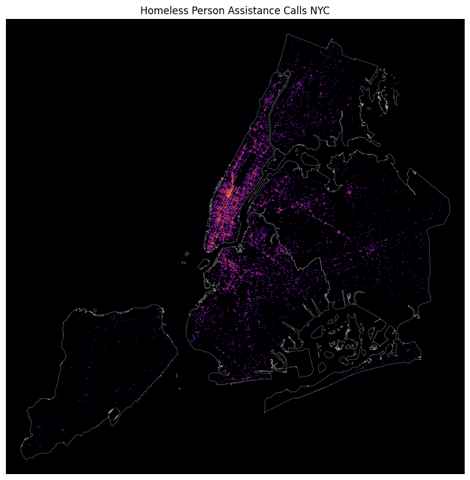

# Heatmap Script


The code in this repository is useful for producing a "heatmap" of geospatial data in Python.  It works by creating a 2-D array of pixels (basically, an image) where each pixel represents a square of the coordinate space, and its intensity reflects the relative count of points within that square.

## Installation:
- Three libraries are used prominently:
    - `matplotlib` (plotting)
    - `pandas` (tabular data handling)
    - `scipy` (only for its gaussian blur function)
- `geopandas` can be helpful if you want to plot shapes alongside the heatmap or need to read geospatial data.
- `ipykernel` needs to be installed in order to run the example notebook.

Complete list of requirements is in `requirements.txt`.

### Clone Project:
```shell
$ git clone https://github.com/maysj-omb/heatmap
$ cd heatmap
```

### Install Libraries with `pip`:
Honestly this code should be fairly version agnostic on Python3, but if you would like to clone my environment exactly:
```shell
heatmap $ pip install virtualenv
heatmap $ virtualenv <-p <optional path to python 3.8>> .venv
heatmap $ source .venv/bin/activate
(.venv) heatmap $ pip install -r requirements.txt
```

## Use:
See example notebook to get started.

## Common Problems and F.A.Q.'s:
- I am having trouble plotting geometries alongside my heatmap:
    - This could be because they are not in the same [coordinate reference system](https://en.wikipedia.org/wiki/Spatial_reference_system).
    - This could also be an issue with `bounds`.  The heatmap image is rendered to the final figure using the matplotlib function `axes.imshow()` and the `extent` parameter of that function is set to the `bounds` tuple that *you* pass in, which is based on actual coordinates.  This is the only thing tying the image to the actual coordinates on the map. Without `extent=bounds...`, your image is just a collection of pixels with no reference to the real world.  Try ensuring that the plot function is using the same `bounds` tuple for plotting the heatmap image and the geometries.
- Most points are showing up as very light while only the very maxima show up prominently:
    - Try increasing the `root` parameter so that lower values are mapped to higher colormap intensities (appear closer to the maxima).
- My points are intense enough, but are very sparse:
    - You can try several things: 
        1. increase `area_size` so that more pixels appear with some color.
        2. set `blur` to true.
        3. if `blur` is true, try increasing `sigma` to increase the width of the blur.
- I have found a bug or issue with the code:
    - Create a GitHub issue [here](https://github.com/maysj-omb/heatmap/issues).
